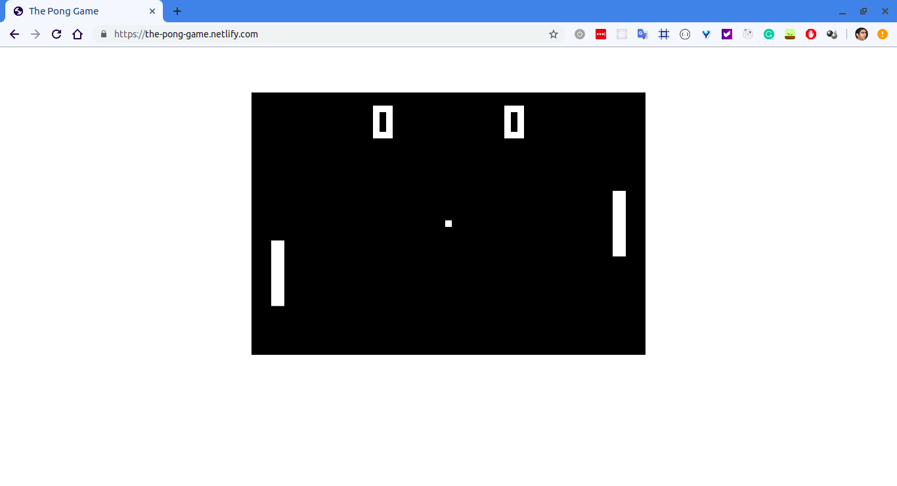

# Pong
🏓 The classic "Pong" #game in JavaScript. 🏓

### Instructions
Clicking on the screen starts the game. Use the mouse to move around to shoot the ball back to the side of the computer. If you lose the game, the ball is centered on the screen. We will update the game so that it's easier to play. Currently, the ball velocity increases as the time progresses. 

## DEMO
Visit this site to play the game: https://the-pong-game.netlify.com/

## Screenshot

